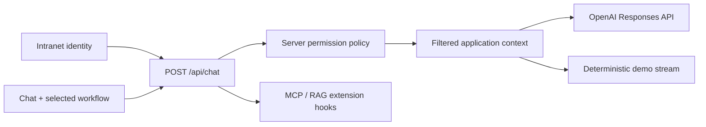

# Supply Chain Hub

An intranet-ready supply chain decision workspace that turns fragmented ERP, supplier, spreadsheet, and email evidence into grounded operational recommendations.

## What Is Included

- Next.js App Router application with React and TypeScript.
- Vercel AI SDK chat client and streaming server route.
- OpenAI model and reasoning-level selectors.
- Server-built context for every request.
- Server-derived mock identity with least-privilege dataset access.
- Deterministic sample responses when no live API key is configured.
- Extension points in `lib/chat-extensions.ts` for MCP tools and RAG context.

## Workflows

1. **Weekly risk scan** replaces manual reconciliation across SAP, supplier portals, Excel, and email with an authorized, source-grounded risk brief.
2. **14-day supplier delay** traces the affected BOM and orders, simulates inventory exposure, and proposes mitigations with clear tradeoffs.
3. **Procurement optimization** combines cost, operational risk, resilience, quality, and policy guardrails before recommending sourcing changes.

## Run Locally

```bash
npm install
cp .env.example .env.local
npm run dev
```

Open [http://localhost:3000](http://localhost:3000).

The sample key keeps the app in demo mode, so chat works immediately with deterministic responses grounded in the selected workflow. To use OpenAI, replace the value in `.env.local`:

```bash
OPENAI_API_KEY=sk-your-real-key
```

The key is read only by `app/api/chat/route.ts` and is never sent to the browser. Restart the dev server after changing environment variables.

## Mock Intranet Identity

The browser does not choose or submit a role. `getCurrentUser()` resolves identity on the server, and the API rebuilds its permission-filtered context from that trusted identity.

Use one of these values in `.env.local`, then restart the server:

```bash
DEMO_USER_ROLE=logistics
# or
DEMO_USER_ROLE=procurement
```

`logistics` is the least-privilege default and cannot access supplier impact data. `procurement` represents a Procurement Lead and can access the Impact column and impact-grounded chat answers.

In production, replace `getCurrentUser()` in `lib/auth.ts` with claims from the company identity provider, such as Microsoft Entra ID or Okta. Map immutable group or application-role claims to internal policies on the server; never trust a role sent by the browser.

## Chat Architecture



Each browser request sends only the selected workflow, model, and reasoning preference. The server resolves the user and filters the trusted supplier snapshot before it reaches either the model or demo response generator.

To add retrieval, return grounded passages from `loadExternalContext()`. To add MCP or application actions, register AI SDK tools in `getChatTools()`.

## Commands

```bash
npm test
npm run typecheck
npm run build
```

## Production Upgrade Path

Replace the synthetic data with bounded, audited connectors for:

- SAP or another ERP for orders, parts, inventory, demand, and supplier master data.
- Supplier portals and scorecards for confirmations, capacity, quality, and performance.
- Contracts and policies retrieved through permission-aware RAG.
- Logistics, quality, weather, geopolitical, and financial risk signals.
- Tool calls for scenario simulation, approval workflows, and audit logging.

Start with one product family, one supplier category, the three included decision workflows, and a measurable baseline for time-to-decision and avoided disruption.
