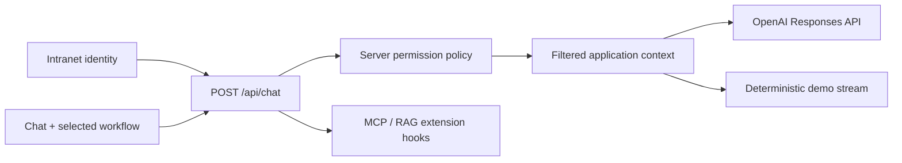

# Supply Chain Hub

An intranet-ready supply chain decision workspace that turns fragmented ERP, supplier, spreadsheet, and email evidence into grounded operational recommendations.

## What Is Included

- Next.js App Router application with React and TypeScript.
- Vercel AI SDK chat client and streaming server route.
- OpenAI model and reasoning-level selectors.
- Server-built context for every request.
- Least-privilege mock identity plus an explicit in-app access simulation for demos.
- Deterministic sample responses when no live API key is configured.
- Collapsible OpenAI reasoning summaries for live Responses API calls.
- Extension points in `lib/chat-extensions.ts` for MCP tools and RAG context.

## Workflows

1. **Risk radar** checks SAP, warehouse stock, DHL Freight, FedEx, and other selected carrier tools for part-specific delivery exceptions.
2. **Supplier alternatives** is available to the Procurement Team Lead and Chief Logistics Officer. It traces affected orders, checks qualified substitutes, and prepares operational updates and supplier follow-ups.
3. **Executive supplier portfolio** is reserved for the Chief Logistics Officer and produces a prompt-triggered cost-versus-resilience heat map with policy guardrails and C-level approval gates.

## Run Locally

```bash
npm install
cp .env.example .env.local
npm run dev
```

Open [http://localhost:3000](http://localhost:3000).

The sample key keeps the app in demo mode, so chat works immediately with deterministic responses grounded in the selected workflow. To use OpenAI, replace the value in `.env.local`:

```bash
OPENAI_API_KEY=sk-your-real-key
```

The key is read only by `app/api/chat/route.ts` and is never sent to the browser. Restart the dev server after changing environment variables.

## Mock Intranet Identity

`getCurrentUser()` resolves the initial mock identity on the server. The left-rail **Access simulation** selector lets a presenter demonstrate the logistics and procurement views. This browser-selected identity is honored only while the app is using the sample API key; a live OpenAI configuration continues to use the server-derived identity.

Use one of these values in `.env.local`, then restart the server:

```bash
DEMO_USER_ROLE=logistics
# or
DEMO_USER_ROLE=procurement
# or
DEMO_USER_ROLE=executive
```

`logistics` is the least-privilege default. It sees only the operational delivery radar and never receives money values or quantified business-risk fields. `procurement` represents Dana Narid, Procurement Team Lead, and unlocks supplier alternatives and financial context. `executive` represents Dr. Lucía López, Chief Logistics Officer, and additionally unlocks the executive portfolio workflow and approval routing.

With a live OpenAI key, streamed reasoning summaries appear inside assistant messages, collapse automatically when the response finishes, and can be reopened. These summaries are not private model chain-of-thought.

In production, replace `getCurrentUser()` in `lib/auth.ts` with claims from the company identity provider, such as Microsoft Entra ID or Okta. Map immutable group or application-role claims to internal policies on the server; never trust a role sent by the browser.

## Chat Architecture



Each browser request sends only the selected workflow, model, and reasoning preference. The server resolves the user and filters the trusted supplier snapshot before it reaches either the model or demo response generator.

To add retrieval, return grounded passages from `loadExternalContext()`. To add MCP or application actions, register AI SDK tools in `getChatTools()`.

## Commands

```bash
npm test
npm run typecheck
npm run build
```

## Production Upgrade Path

Replace the synthetic data with bounded, audited connectors for:

- SAP or another ERP for orders, parts, inventory, demand, and supplier master data.
- Supplier portals and scorecards for confirmations, capacity, quality, and performance.
- Contracts and policies retrieved through permission-aware RAG.
- Logistics, quality, weather, geopolitical, and financial risk signals.
- Tool calls for scenario simulation, approval workflows, and audit logging.

Start with one product family, one supplier category, the three included decision workflows, and a measurable baseline for time-to-decision and avoided disruption.
