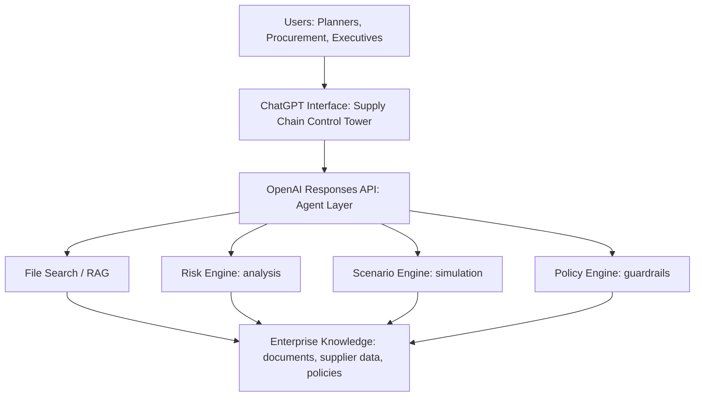
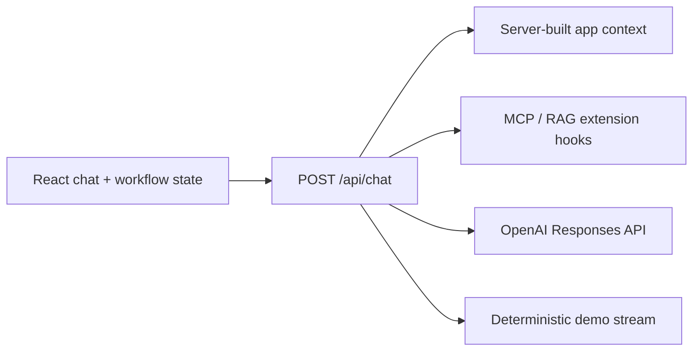

# Supply Chain Hub

Context-aware supply chain copilot for inventory, cost, delivery, and risk decisions. The application combines an operational dashboard with a streaming chat interface grounded in the currently selected workflow and supplier data.

## What Is Included

- Next.js App Router application with React and TypeScript.
- Vercel AI SDK chat client and streaming server route.
- OpenAI model selector for GPT-5.5, GPT-5.4, GPT-5.4 mini, and GPT-5.4 nano.
- Reasoning selector from none through extra high.
- Server-built application context for every request.
- Deterministic demo mode when no live API key is configured.
- Extension points in `lib/chat-extensions.ts` for MCP tools and RAG context.

This repository supports an executive-level OpenAI presentation:

**From Fragmented Supply Chains to AI-Driven Decision Intelligence**

The demo is intentionally lightweight, deterministic, and presentation-safe. It shows how ChatGPT and the OpenAI API can become a secure supply-chain control tower across fragmented planning, procurement, supplier, and policy data.

## Executive Story

Manufacturing supply chains are not short on data. They are short on decision intelligence.

Typical pain points:

- Planners, buyers, and executives work from different systems and different summaries.
- Risk signals arrive as emails, spreadsheets, supplier portals, ERP data, logistics updates, and policy documents.
- Scenario planning is slow, manual, and hard to explain.
- Executives need recommended action, not another dashboard.

OpenAI's role in the story:

- **ChatGPT** is the natural-language interface for planners, procurement, and executives.
- **Responses API** is the agent layer that reasons over context and calls tools.
- **File Search / RAG** grounds answers in enterprise knowledge.
- **Risk, scenario, and policy engines** add deterministic business logic.
- **Guardrails and human review** keep sensitive decisions controlled.

## Architecture Flow



## Demo Workflows

1. **Weekly risk scan**: "What are the current top supply chain risks across all suppliers this week?"
2. **Delay scenario**: "What happens if Supplier A is delayed by 2 weeks?"
3. **Supplier consolidation**: "Which suppliers should we consolidate, and what is the risk impact?"

Each workflow demonstrates the same decision loop:

1. Ask a business question.
2. Route through the OpenAI agent layer.
3. Retrieve trusted supply-chain context.
4. Run analysis or simulation.
5. Apply policy constraints.
6. Return an explainable recommendation with evidence.

## Run Locally

```bash
npm install
cp .env.example .env.local
npm run dev
```

Open [http://localhost:3000](http://localhost:3000).

The sample key keeps the app in demo mode, so chat works immediately with deterministic responses grounded in the selected dashboard workflow. To use OpenAI, replace the value in `.env.local`:

```bash
OPENAI_API_KEY=sk-your-real-key
```

The key is read only by `app/api/chat/route.ts` and is never sent to the browser. Restart the dev server after changing environment variables.

## Commands

```bash
npm test
npm run typecheck
npm run build
```

## Chat Architecture



Each request sends only the selected workflow key plus model and reasoning preferences. The server rebuilds the trusted supplier snapshot, preventing browser-provided data from becoming the source of truth.

To add retrieval, return grounded passages from `loadExternalContext()`. To add MCP or application actions, register AI SDK tools in `getChatTools()`.

## Production Upgrade Path

For a customer pilot, replace the synthetic data with:

- ERP and planning data for orders, parts, inventory, and demand.
- Supplier scorecards, contracts, and policy documents.
- Logistics, quality, weather, geopolitical, and financial risk signals.
- Tool calls for risk scoring, scenario simulation, policy checks, and audit logging.

Start with a narrow pilot: one product family, one supplier category, three decision workflows, and a clear measurement baseline.
