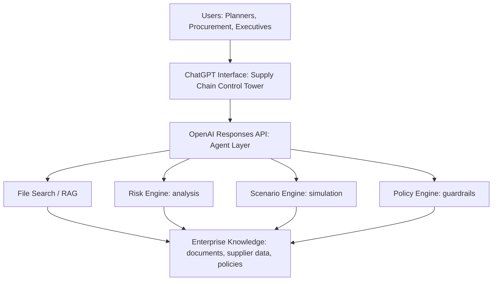

# Executive Presentation Runbook

## Title

**From Fragmented Supply Chains to AI-Driven Decision Intelligence**

Subtitle: **OpenAI as a secure platform for supply-chain optimization**

Audience: manufacturing executives, supply-chain leaders, procurement leaders, planners, IT / enterprise architecture.

Target customer framing: a precision manufacturing company with complex suppliers, high quality requirements, regulated processes, long lead times, and expensive disruption.

## Two OpenAI Solution Areas To Sell

### 1. ChatGPT Enterprise as the Supply Chain Control Tower

Message: ChatGPT gives every role a natural-language interface into supply-chain knowledge and decisions.

What they should remember:

- Planners ask operational questions without searching five systems.
- Procurement asks supplier and contract questions without building a new dashboard.
- Executives ask business-impact questions and get evidence-backed summaries.
- The interface can expose role-specific answers, cited sources, and human approval steps.

### 2. OpenAI API as the Decision Intelligence Layer

Message: The API turns ChatGPT from an interface into an integrated enterprise workflow.

What they should remember:

- Responses API coordinates model reasoning, context, and tool calls.
- File Search / RAG grounds answers in internal documents and supplier data.
- Function tools connect to risk, scenario, policy, ERP, planning, and workflow systems.
- Guardrails and human review make the system controllable for enterprise operations.

## 30-Minute Agenda

### 0:00-2:30 - Executive Opening

Start with the business problem:

"Supply chains are not fragmented because companies lack data. They are fragmented because the decision context is scattered across systems, functions, and time horizons. The opportunity is to move from dashboards that describe the past to AI-assisted workflows that recommend the next best action."

Position the session:

"In the next 30 minutes, I will show two OpenAI solution areas: ChatGPT as the control tower interface, and the OpenAI API as the decision intelligence layer behind it."

### 2:30-6:00 - Current-State Pain

Use a manufacturing lens:

- A planner sees inventory and production impact.
- Procurement sees supplier status, contracts, and alternatives.
- Quality sees defects and corrective actions.
- Logistics sees port, customs, and carrier disruption.
- Executives see margin, revenue, and customer commitments.

Core line:

"The same disruption is interpreted differently by every function. OpenAI helps collapse that fragmentation into a shared decision surface."

Slide 03 discovery bridge:

"In our initial technical discovery, the pain was not a lack of dashboards. The working hypothesis is that a risk review can begin with roughly 20 minutes of reconciling SAP, supplier, logistics and workbook updates. When those sources conflict, scarce domain experts become the bottleneck. Mitigation starts later, while expedite spend, schedule churn and approval ambiguity increase. The POC must now validate that baseline with ZEISS rather than treat it as a proven production fact."

### 6:00-9:00 - Target Architecture

Show this architecture:

Narration:

"ChatGPT is where users work. The Responses API is the orchestration layer. It retrieves trusted context, calls analytical tools, runs simulations, applies policy controls, and returns recommendations with evidence."

### 9:00-27:00 - Business Workflow Demo And Q&A

Use the local app at `http://localhost:8000`.

The key is to narrate both the business workflow and the architecture trace visible in the demo.

#### Workflow 1: Weekly Risk Scan, 6 minutes

Question: "What are the current top supply chain risks across all suppliers this week?"

Business value:

- Converts scattered signals into a ranked risk list.
- Helps planners and executives align on the same priorities.
- Makes evidence visible next to the recommendation.

Architecture line:

"Behind this answer, the agent retrieves supplier context, applies a risk model, ranks impact, and enforces a policy that the answer must include evidence and human-owned next steps."

Likely Q&A:

- Q: "Can this use our real supplier data?"
- A: "Yes. The production pattern is to connect approved enterprise sources through retrieval and tools. The model should not be the system of record; it should reason over governed systems of record."

#### Workflow 2: Supplier A Delay, 6 minutes

Question: "What happens if Supplier A is delayed by 2 weeks?"

Business value:

- Moves from monitoring to scenario planning.
- Quantifies affected orders, production gap, and mitigation cost.
- Gives planners tradeoffs they can explain.

Architecture line:

"This is where the API layer matters. The model frames the scenario, retrieves constraints, calls a simulation tool, and summarizes mitigation options in business language."

Likely Q&A:

- Q: "Can we trust the simulation?"
- A: "The simulation should remain deterministic and owned by the business. OpenAI explains, orchestrates, and recommends based on tool outputs; it does not replace validated planning logic."

#### Workflow 3: Supplier Consolidation, 6 minutes

Question: "Which suppliers should we consolidate, and what is the risk impact?"

Business value:

- Shows strategic decision support, not just alerts.
- Balances savings against resilience.
- Prevents risky consolidation where redundancy matters.

Architecture line:

"The policy engine is critical here. The system can recommend consolidation where switching cost is low, but block recommendations that violate resilience or concentration-risk rules."

Likely Q&A:

- Q: "How do we avoid unsafe recommendations?"
- A: "Use scoped tools, structured outputs, guardrails, citations, approval workflows, and audit logs. The model proposes; governed workflows decide."

#### Slide 08: POC Value And Decision Gates

Frame the headline as a conservative hypothesis for one repeatable workflow, not enterprise-wide ZEISS value:

- Faster review work: 600–1,000 reviews × 20 minutes saved × €75 per hour = approximately €15K–€25K.
- Fewer urgent expedites: 12–18 avoided cases × €8,400 = approximately €101K–€151K.
- Lower disruption exposure: 0.35–0.70 probability-weighted events × €185,000 = approximately €65K–€130K.
- Combined value: approximately €181K–€306K, rounded on the slide to €0.2M–€0.3M.

Core line:

"For an organization of ZEISS’s scale, this is intentionally narrow. It is the value hypothesis for one workflow or operating scope. ZEISS still needs to confirm the baseline, attribution, annual run cost and rollout scope before we extrapolate."

Close on the four gates: process improvement, decision quality, technical reliability and accountable human review for every high-impact action.

### 27:00-30:00 - Close And Next Step

Close with:

"The opportunity is not to build another dashboard. It is to create a secure decision layer where each role can ask the right question, get grounded context, simulate options, and move faster with control."

Recommended next step:

"Start with a six-week pilot around one product family and one supplier category. Measure time-to-triage, scenario turnaround time, decision quality, and adoption by planners and procurement."

## Demo Setup

Before going onsite:

- Push the repo to GitHub.
- Run the app locally and test all three workflow buttons.
- Keep a static backup recording in case Wi-Fi or authentication fails.
- Prepare one architecture slide and one value slide.
- Prepare three customer-specific examples using their likely language: precision parts, optical components, contract manufacturers, quality escapes, regulatory constraints, long lead-time materials.

## Positioning Language

Use:

- "decision intelligence layer"
- "control tower interface"
- "grounded in enterprise knowledge"
- "tool-using agent layer"
- "human-controlled workflow"
- "evidence-backed recommendations"
- "secure platform pattern"

Avoid:

- "The model knows your supply chain"
- "Fully autonomous procurement"
- "Replace planners"
- "Just upload all your data"

## Security And Governance Talking Points

- Keep systems of record in existing enterprise platforms.
- Use retrieval and tool calls to expose only approved context.
- Apply role-based access and approval workflows around sensitive actions.
- Log prompts, tool calls, outputs, approvals, and rejected recommendations.
- Separate recommendations from execution for high-impact supply-chain decisions.

## Customer-Specific Questions To Ask Onsite

- Where do supply-chain decisions slow down today: risk triage, allocation, scenario planning, supplier negotiations, or executive reporting?
- Which systems contain the trusted source of supplier, inventory, and policy data?
- Which decisions require human approval by policy?
- Which three workflows would create measurable value in six weeks?
- What risk, compliance, or data residency constraints should shape the pilot?
